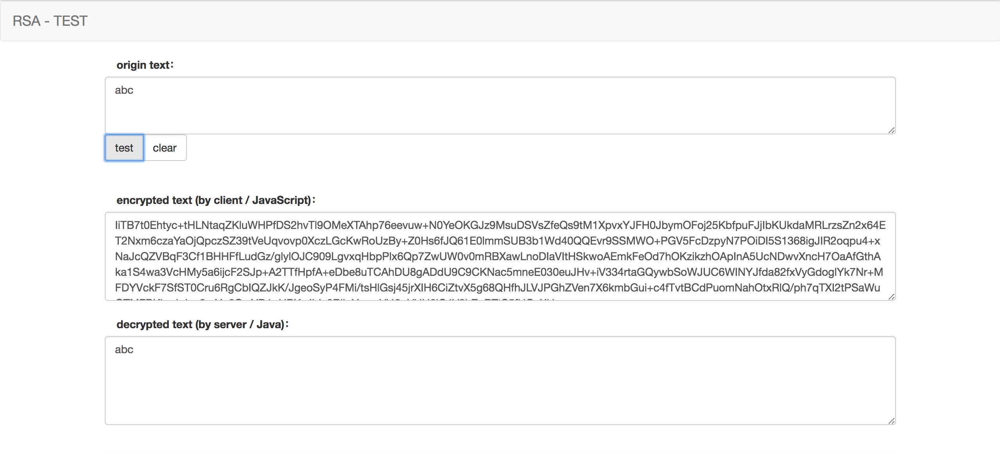

# RSA MESSAGE TRANSPORTATION

RSA message transportation between client(JavaScript) and server(Java),  
Client encrypt message by public key, while server decrypt by private key.  

## Structure

```
|- src
    |- main
        |- bin          startup/shutdown script
        |- java         java source code
        |- resources    configuration folder
    |- test
        |- java         unit test source code
|- web
    |- lib              javascript libruary
    |- index.html       index page
|- assembly.xml         package assembly configuration file
|- pom.xml              project configuration file
```

Web applications built by **SpringBoot**

## Build & Run

### clone project 
```
git clone xxx
```

### build 
```
mvn clean package -Dmaven.test.skip=true
```

### run
```
cd ${unpackaged-dir}/bin

./server.sh start
```

### test
Access page **http://127.0.0.1:9500** and test, like image below:  

